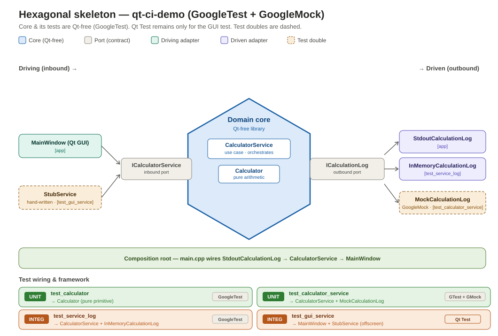

# qt-ci-demo — hexagonal skeleton with a unit + integration test strategy

A small Qt/C++ project that demonstrates a **hexagonal (ports & adapters)**
architecture with a clean **unit / integration** test split and a staged
CI pipeline. The arithmetic `Calculator` is a deliberate **placeholder** for a
real domain core (e.g. a sensor/detection pipeline); the point of the repo is the
*structure and test strategy*, not the maths.

## Idea in one sentence

A **Qt-free domain core** sits in the middle; everything else plugs into it
through **ports** (interfaces the core owns), so the core can be exercised with
no GUI and no hardware attached — which is what makes fast, reliable tests
possible.

## Architecture

- **Core** (`src/core/`) — `Calculator` (pure primitive) and `CalculatorService`
  (the use case). Compiled as a library that links **no Qt**; the independence is
  enforced by the compiler, not by convention.
- **Ports** (`src/ports/`)
  - `ICalculatorService` — *inbound* port; the use case the outside world drives.
  - `ICalculationLog` — *outbound* port; something the core needs from outside.
    (In the real product this becomes `ISensorSource` / `IResultSink`.)
- **Adapters** (`src/adapters/`)
  - *Driving:* `MainWindow` (Qt GUI). *(In tests: a hand-written `StubService`.)*
  - *Driven:* `StdoutCalculationLog` (app), `InMemoryCalculationLog` (tests).
    *(In tests: a GoogleMock `MockCalculationLog`.)*
- **Composition root** (`src/main.cpp`) — the only place that picks concrete
  adapters and wires them into the core.

**Dependency rule:** dependencies point *inward*, toward the core. The core
depends on nothing outside itself.

## Layout

    src/
      core/      Calculator, CalculatorService        (pure C++17, NO Qt)
      ports/     ICalculatorService (inbound)
                 ICalculationLog    (outbound) + Calculation
      adapters/  InMemoryCalculationLog, StdoutCalculationLog   (driven)
                 gui/MainWindow                                 (driving)
      main.cpp   composition root
    tests/
      unit/          test_calculator, test_calculator_service
      integration/   test_service_log, test_gui_service
      mocks/         MockCalculationLog (GoogleMock)
    docs/            architecture.svg

## Requirements

- CMake ≥ 3.20, Ninja (or another generator), a C++17 compiler
- Qt 6 (`Widgets`, `Test`)
- Network access at configure time (GoogleTest is fetched via `FetchContent`),
  or vendor GoogleTest for an offline/hermetic build

## Build

    cmake -B build -G Ninja -DCMAKE_BUILD_TYPE=Release
    cmake --build build

## Test

The suite is split by level so CI can run fast tests first.

    ctest --test-dir build                 # everything
    ctest --test-dir build -L unit         # fast gate (no display, no Qt)
    ctest --test-dir build -L integration  # components wired across ports

On a single-config build (Ninja/Makefiles, e.g. inside the Docker image), the
commands above are enough. On a multi-config build (Visual Studio, e.g. building
locally on Windows), add `-C <config>` to match the config you built, or CTest
will report `test_gui_service` (and any other plainly `add_test`-registered
test) as "Not Run":

    ctest --test-dir build -C Debug
    ctest --test-dir build -L unit -C Debug
    ctest --test-dir build -L integration -C Debug

| Test | Level | Framework | Wires together |
|------|-------|-----------|----------------|
| `test_calculator`          | unit        | GoogleTest            | `Calculator` (pure) |
| `test_calculator_service`  | unit        | GoogleTest + GoogleMock | `CalculatorService` + `MockCalculationLog` |
| `test_service_log`         | integration | GoogleTest            | `CalculatorService` + `InMemoryCalculationLog` |
| `test_gui_service`         | integration | Qt Test               | `MainWindow` + `StubService` (headless / offscreen) |

**Why two frameworks?** The core and its tests are kept **Qt-free** by testing
them with GoogleTest/GoogleMock, so they build and run on a bare (or cross-)
toolchain. **Qt Test** is used only for `test_gui_service`, which genuinely needs
the Qt event loop, `QTest` input simulation, and the `offscreen` platform.

## Reproducibility in Linux docker

Build and run it:

    docker build -t qt-ci-demo:local .
    docker run --rm -v "$PWD/results:/app/results" qt-ci-demo:local
    cat results/tests.xml   # JUnit XML — one artifact, multiple downstream consumers

## CI/CD

- `Dockerfile` builds the project (fetching + hash-checking GoogleTest) and runs
  the suite, emitting a JUnit report via `ctest --output-junit`.
- `Jenkinsfile` runs **staged, fail-fast**: build image → unit tests → integration
  tests, publishing JUnit after each stage. A unit-test failure stops the
  pipeline before the slower integration stage runs.
- `Jenkinsfile`'s test stages write results to `${HOST_RESULTS_DIR:-$PWD/results}`
  — on a normal CI agent (nothing special set), this defaults to a
  workspace-relative `results/` folder, matching the `docker run` command above.
  `HOST_RESULTS_DIR` only needs to be set explicitly in one specific scenario:
  running Jenkins itself inside Docker on a machine where the Jenkins
  container talks to the *host's* Docker engine over a mounted socket
  ("Docker-outside-of-Docker"), because in that setup the inner `docker run`
  call is executed by the host engine, which needs a *host-native* path, not a
  path meaningful only inside the Jenkins container. See
  `docs/jenkins-local-setup.md` for that specific local-sandbox setup and why
  the override is needed there.

## Reproducibility notes

- **GoogleTest is pinned** (`v1.15.2`) with a SHA256 `URL_HASH` in `CMakeLists.txt`.
- **Qt version:** Debian Bookworm ships Qt **6.4.2**, which is *not* the shipping
  version (**6.11.x**). For certifiable/reproducible builds, pin package versions
  or install the target Qt via `aqtinstall`, and pin the Docker base image by
  digest (see comments in `Dockerfile`).

## Mapping to the real product

This skeleton is intentionally tiny. To grow it into the real system:

- `Calculator` / `CalculatorService` → the real **detection core**.
- `ICalculatorService` → `IDetectionService` (inbound).
- `ICalculationLog` → split into `ISensorSource` (inbound data) and
  `IResultSink` (outbound results).
- Add **contract tests**: one parametrized suite that both a fake/mock adapter
  *and* the real adapter must pass, so test doubles can't drift from reality.
- Add the higher tiers: accuracy-regression on versioned datasets, and
  hardware-in-the-loop, run nightly/pre-release.

## Licensing (test tooling)

Test frameworks are build/test-time only and do not ship in the application
binary. GoogleTest/GoogleMock are **BSD-3-Clause** (permissive, production-safe);
Qt Test is part of Qt (used here under your existing Qt licensing). Confirm
license obligations with whoever owns compliance — this is not legal advice.
